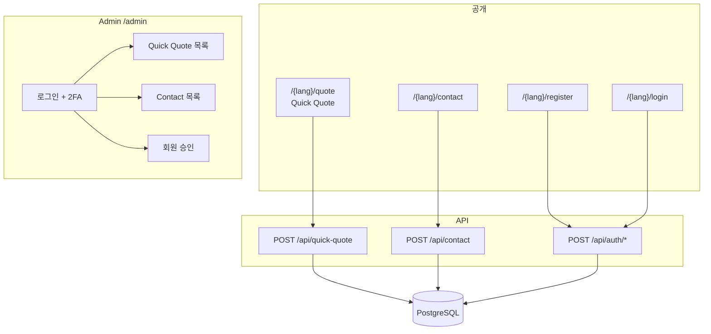

# 01. Phase 3 통합 기획서 — Quick Quote · Contact · 회원 · Admin

> **상태**: 기획 작성 완료 (개발 착수 전 검토용)  
> **작성일**: 2026-05-21  
> **적용 Phase**: 마스터 **Phase 3**  
> **참조**: `00_master_plan.md` §4-5, §7, §9, §10 · `03_plan_quick_quote_integration.md` · `document/data_dictionary/00_schema.md`

---

## 0. 문서 목적

Phase 3에 포함되는 **백엔드·DB·API·Admin·이메일**을 한 문서에서 개발 가능한 수준으로 정의한다.

| 포함 | 제외 (별도 기획서) |
|------|-------------------|
| Quick Quote 1차 (03 Ph1) | Quote Wizard UI·가격 (Phase 4 → `02_plan` + §7-1) |
| Contact 폼 + 파일 첨부 | Phase 2 정적 UI → **`04_plan_phase2_static_frontend.md`** |
| B2B 회원가입·JWT·이메일 인증 | ERP inquiry API (Phase 5 → `03_plan` Ph2) |
| Admin 로그인·2FA·목록·승인 | ERP 마스터 DB pg_dump (Phase 4 → `02_plan`) |

---

## 1. Phase 3 모듈 구성



---

## 2. 구현 현황 (코드 기준 — 2026-05-21)

> ⚠️ 기획 완료 전 일부 bootstrap 코드가 존재함. **본 문서 승인 후** 잔여 구현·리팩터링 진행.

| 항목 | 상태 | 비고 |
|------|------|------|
| `requirements.txt`, `alembic.ini`, `backend/main.py` | ✅ | `Literal["en","ko"]` lang 라우트 |
| `quick_quote_inquiries` + migration `001_quick_quote` | ✅ | `document/data_dictionary/00_schema.md` |
| `POST /api/quick-quote` | ✅ | reCAPTCHA, rate limit, Mailnara |
| `GET /{lang}/quote` 임시 폼 | ✅ | Phase 2 UI 전 placeholder |
| Contact / Auth / Admin / `users` / `contact_inquiries` | ❌ | **본 문서 범위** |
| i18n JSON 번역 파일 | ❌ | Phase 2·3 병행 |

---

## 3. Quick Quote (1차) — 요약

**상세**: `03_plan_quick_quote_integration.md` (필드·API·이메일 본문 전체)

| 항목 | 값 |
|------|-----|
| URL | `/{lang}/quote` |
| API | `POST /api/quick-quote` |
| 테이블 | `quick_quote_inquiries` |
| 로그인 | 불필요 |
| reCAPTCHA | v3, score ≥ 0.5 (개발: `RECAPTCHA_SKIP_VERIFY=true`) |

**Phase 3 잔여 (03 기준)**

- [ ] i18n JSON 연동 (폼 레이블·에러·완료 문구 — 03 §6-3)
- [ ] Phase 2 Contact/Quote 페이지와 **공통 레이아웃** (헤더·푸터) 통합
- [ ] Admin Quick Quote 목록·상태 변경 UI (§9-4)

---

## 4. Contact 문의

### 4-1. 정책 (마스터 §7 확정)

| 항목 | 내용 |
|------|------|
| 처리 | **DB 저장 + Mailnara 이메일** 동시 |
| 수신 | `SALES_NOTIFY_EMAIL` (= `sbchung@innovotech.co.kr`) |
| 카테고리 | `test_socket` / `probe_pin` / `test_jig` / `other` |
| 파일 첨부 | **선택**, DXF·PDF·STEP 등 |
| 기밀 문서 | 폼 안내: **직접 이메일** 발송 권장 (웹 업로드 비권장) |

### 4-2. 화면 — `/{lang}/contact`

| 영역 | 요소 |
|------|------|
| 상단 | 회사 주소·Tel·Fax·Email (§4-2 푸터와 동일) |
| 지도 | Google Maps embed 또는 static map (Phase 2 UI) |
| 폼 | 아래 필드 + reCAPTCHA v3 + 개인정보 동의 |

**입력 필드**

| 필드명 | UI 라벨 (EN) | 타입 | 필수 | 검증 |
|--------|-------------|------|------|------|
| `category` | Inquiry Category | Select | ✅ | enum 4종 |
| `company_name` | Company Name | Text | ✅ | max 100 |
| `contact_name` | Your Name | Text | ✅ | max 50 |
| `contact_email` | Email | Email | ✅ | max 254 |
| `contact_phone` | Phone | Tel | ❌ | max 30 |
| `subject` | Subject | Text | ✅ | max 200 |
| `message` | Message | Textarea | ✅ | max 5000 |
| `attachment` | Attach File (optional) | File | ❌ | §4-3 |
| `privacy_agreed` | Privacy Policy consent | Checkbox | ✅ | false → 400 |
| `recaptcha_token` | (hidden) | — | ✅ | v3 검증 |
| `lang` | (hidden) | — | ✅ | `en` \| `ko` |

**기밀 문서 안내 문구 (폼 상단 고정)**

- EN: *For NDA or security-classified documents, please email us directly at sbchung@innovotech.co.kr instead of uploading here.*
- KO: *NDA·보안 등급 문서는 웹 업로드 대신 sbchung@innovotech.co.kr 로 직접 보내 주세요.*

### 4-3. 파일 첨부 정책

| 항목 | 값 | 근거 |
|------|-----|------|
| 허용 확장자 | `.pdf`, `.dxf`, `.step`, `.stp` | 마스터 §7 |
| 파일당 최대 | **10 MB** | ✅ 2026-05-21 확정 |
| 요청당 파일 수 | **1개** (Phase 3) | ✅ 확정 |
| 저장 경로 | `upload/contact/{inquiry_id}/{uuid}_{원본명}` | Phase 6 S3 이전 |
| 바이러스 스캔 | Phase 6 (ClamAV 등) | Phase 3는 확장자·MIME 이중 검증 |

**MIME 허용**: `application/pdf`, `application/dxf`, `model/step`, `application/octet-stream` (STEP fallback)

### 4-4. API — `POST /api/contact`

**Content-Type**: `multipart/form-data`

| Part | 설명 |
|------|------|
| `data` | JSON 문자열 — 아래 Request Body |
| `file` | optional binary |

**Request Body (JSON in `data`)**

```json
{
  "category": "test_socket",
  "company_name": "Acme Semi",
  "contact_name": "Jane Doe",
  "contact_email": "jane@acme.com",
  "contact_phone": "+82-10-1234-5678",
  "subject": "Custom socket inquiry",
  "message": "We need a quote for...",
  "privacy_agreed": true,
  "recaptcha_token": "03AGdBq...",
  "lang": "en"
}
```

**Response 200**

```json
{
  "success": true,
  "inquiry_id": 15,
  "message": "Your inquiry has been received. We will respond within 1-2 business days."
}
```

**HTTP 오류**

| 코드 | 조건 |
|------|------|
| 400 | 검증 실패, privacy 미동의, reCAPTCHA 실패, 파일 형식/용량 초과 |
| 413 | 파일 10MB 초과 |
| 429 | Rate limit |
| 500 | DB·저장 실패 |

### 4-5. DB — `contact_inquiries`

```sql
CREATE TABLE contact_inquiries (
    id                SERIAL       PRIMARY KEY,
    category          VARCHAR(20)  NOT NULL,   -- test_socket | probe_pin | test_jig | other
    company_name      VARCHAR(100) NOT NULL,
    contact_name      VARCHAR(50)  NOT NULL,
    contact_email     VARCHAR(254) NOT NULL,
    contact_phone     VARCHAR(30),
    subject           VARCHAR(200) NOT NULL,
    message           TEXT         NOT NULL,
    -- 첨부 (없으면 NULL)
    attachment_path   VARCHAR(500),            -- 상대 경로 upload/contact/...
    attachment_name   VARCHAR(255),            -- 원본 파일명
    attachment_size   INTEGER,                 -- bytes
    attachment_mime   VARCHAR(100),
    -- 처리
    status            VARCHAR(20)  NOT NULL DEFAULT 'new',
                      -- new | in_progress | replied | closed
    admin_note        TEXT,                    -- 내부 메모 (Admin)
    privacy_agreed_at TIMESTAMPTZ  NOT NULL,
    lang              VARCHAR(2)   NOT NULL DEFAULT 'en',
    created_at        TIMESTAMPTZ  NOT NULL DEFAULT NOW(),
    updated_at        TIMESTAMPTZ  NOT NULL DEFAULT NOW()
);
```

**인덱스**: `created_at DESC`, `status`, `category`

**보관**: 3년 (마스터 §7-3)

### 4-6. 이메일

**영업팀 알림**

- 제목 (KO): `[홈페이지 문의] {category 표시명} — {company_name} / {subject}`
- 본문: 카테고리, 고객 정보, 제목, 본문, 첨부 파일명(있을 때), Admin URL

**고객 확인**

- EN/KO `lang`에 따라 제목·본문 분기 (Quick Quote와 동일 패턴)
- 첨부 파일은 **이메일에 포함하지 않음** — 링크·파일명만 안내 (용량·보안)

---

## 5. B2B 회원 · 인증

### 5-1. 등급 (마스터 §7-2)

| 등급 | DB 표현 | 로그인 | Quick Quote | Quote Wizard (Ph4) | 카탈로그 |
|------|---------|--------|-------------|-------------------|---------|
| 비회원 | (레코드 없음) | — | ✅ | ❌ | ❌ |
| 일반회원 | `membership_tier=general` | ✅ (이메일 인증 후) | ✅ | ✅ (+30%) | ❌ |
| 인증회원 | `membership_tier=verified` | ✅ | ✅ | ✅ (기준가) | ✅ |
| 내부 직원 | `staff_accounts` 테이블 | Admin | — | — | — |

> 고객 `users`와 내부 `staff_accounts` **분리** — Admin JWT와 고객 JWT 분리.

### 5-2. 화면

| URL | 기능 |
|-----|------|
| `/{lang}/register` | 가입 폼 |
| `/{lang}/login` | 로그인 → JWT → redirect |
| `/{lang}/forgot-password` | 비밀번호 찾기 (이메일 입력) |
| `/{lang}/reset-password` | 재설정 폼 (`?token=` 쿼리) |
| `/{lang}/verify-email` | 토큰 검증 결과 페이지 (쿼리 `?token=`) |
| `/{lang}/account` | Phase 4 — 프로필·견적 히스토리 (Phase 3는 로그인만) |

**가입 필드**

| 필드 | 필수 | 검증 |
|------|------|------|
| `full_name` | ✅ | max 50 |
| `company_name` | ✅ | max 100 |
| `email` | ✅ | unique, EmailStr |
| `phone` | ✅ | max 30 |
| `password` | ✅ | min 8, 영문+숫자 포함 |
| `password_confirm` | ✅ | password 일치 |
| `privacy_agreed` | ✅ | |
| `terms_agreed` | ✅ | 이용약관 (§14 미작성) |
| `recaptcha_token` | ✅ | |
| `lang` | ✅ | |

### 5-3. DB — `users`

```sql
CREATE TABLE users (
    id                    SERIAL       PRIMARY KEY,
    email                 VARCHAR(254) NOT NULL UNIQUE,
    password_hash         VARCHAR(255) NOT NULL,
    full_name             VARCHAR(50)  NOT NULL,
    company_name          VARCHAR(100) NOT NULL,
    phone                 VARCHAR(30)  NOT NULL,
    membership_tier       VARCHAR(20)  NOT NULL DEFAULT 'general',
                          -- general | verified  (verified = 인증회원)
    email_verified_at     TIMESTAMPTZ,             -- NULL = 미인증
    verified_by_staff_id  INTEGER,                 -- FK staff_accounts (승인자)
    verified_at           TIMESTAMPTZ,             -- 인증회원 승인 시각
    is_active             BOOLEAN      NOT NULL DEFAULT TRUE,
    privacy_agreed_at     TIMESTAMPTZ  NOT NULL,
    terms_agreed_at       TIMESTAMPTZ  NOT NULL,
    last_login_at         TIMESTAMPTZ,
    created_at            TIMESTAMPTZ  NOT NULL DEFAULT NOW(),
    updated_at            TIMESTAMPTZ  NOT NULL DEFAULT NOW()
);
```

### 5-4. DB — `email_verification_tokens`

```sql
CREATE TABLE email_verification_tokens (
    id          SERIAL       PRIMARY KEY,
    user_id     INTEGER      NOT NULL REFERENCES users(id) ON DELETE CASCADE,
    token_hash  VARCHAR(64)  NOT NULL UNIQUE,   -- SHA-256(hex) 저장, 원문은 URL에만
    expires_at  TIMESTAMPTZ  NOT NULL,
    used_at     TIMESTAMPTZ,
    created_at  TIMESTAMPTZ  NOT NULL DEFAULT NOW()
);
```

- 만료: **24시간** (마스터 §7-2)
- URL: `https://{domain}/{lang}/verify-email?token={raw_token}`

### 5-4-1. DB — `password_reset_tokens`

```sql
CREATE TABLE password_reset_tokens (
    id          SERIAL       PRIMARY KEY,
    user_id     INTEGER      NOT NULL REFERENCES users(id) ON DELETE CASCADE,
    token_hash  VARCHAR(64)  NOT NULL UNIQUE,
    expires_at  TIMESTAMPTZ  NOT NULL,
    used_at     TIMESTAMPTZ,
    created_at  TIMESTAMPTZ  NOT NULL DEFAULT NOW()
);
```

- 만료: **1시간**
- URL: `https://{domain}/{lang}/reset-password?token={raw_token}`
- **Phase 3 포함** — 가입·로그인과 동일 흐름으로 구현

### 5-5. JWT (고객)

| 항목 | 값 |
|------|-----|
| 알고리즘 | HS256 |
| Secret | `SECRET_KEY` (.env) |
| Access token TTL | **60분** |
| Refresh token TTL | **14일** (HttpOnly cookie) |
| Claims | `sub`=user_id, `email`, `tier`=membership_tier, `type`=access\|refresh |

**미인증 계정**: `email_verified_at IS NULL` → 로그인 403 `"email_not_verified"`

### 5-6. API — Auth

| Method | Path | 설명 | Rate limit |
|--------|------|------|------------|
| POST | `/api/auth/register` | 가입 + 인증 메일 발송 | 5/min/IP |
| POST | `/api/auth/login` | JWT 발급 | 10/min/IP |
| POST | `/api/auth/logout` | refresh cookie 삭제 | — |
| POST | `/api/auth/refresh` | access token 갱신 | 20/min/IP |
| GET | `/api/auth/verify-email` | `?token=` 검증 | 10/min/IP |
| POST | `/api/auth/resend-verification` | 인증 메일 재발송 | 3/min/email |
| POST | `/api/auth/forgot-password` | 재설정 메일 발송 (이메일 존재 여부 **응답에 노출 안 함**) | 3/min/IP |
| POST | `/api/auth/reset-password` | `token` + `new_password` 로 변경 | 10/min/IP |
| GET | `/api/auth/me` | Bearer → 현재 사용자 | — |

**POST /api/auth/register — Response 201**

```json
{
  "success": true,
  "message": "Verification email sent. Please check your inbox.",
  "user_id": 1
}
```

**POST /api/auth/forgot-password — Request**

```json
{
  "email": "user@company.com",
  "lang": "en"
}
```

**Response 200** (등록·미등록 이메일 **동일 문구** — 계정 존재 여부 비노출)

```json
{
  "success": true,
  "message": "If an account exists for this email, a reset link has been sent."
}
```

**POST /api/auth/reset-password — Request**

```json
{
  "token": "raw_token_from_email",
  "new_password": "NewPass123",
  "new_password_confirm": "NewPass123"
}
```

**Response 200**: `{ "success": true, "message": "Password updated. You can log in now." }`  
**400**: 토큰 만료·불일치·비밀번호 규칙 위반

**POST /api/auth/login — Response 200**

```json
{
  "access_token": "eyJ...",
  "token_type": "bearer",
  "expires_in": 3600,
  "user": {
    "id": 1,
    "email": "user@company.com",
    "full_name": "Jane Doe",
    "company_name": "Acme Semi",
    "membership_tier": "general",
    "email_verified": true
  }
}
```

### 5-7. 이메일 — 회원

| 트리거 | 수신 | 제목 (KO 예) |
|--------|------|-------------|
| 가입 | 고객 | `[이노보솔루션] 이메일 인증을 완료해 주세요` |
| 인증 완료 | (선택) 고객 | `[이노보솔루션] 이메일 인증이 완료되었습니다` |
| 인증회원 승인 | 고객 | `[이노보솔루션] 인증회원으로 승인되었습니다` (마스터 §7-2) |
| 비밀번호 재설정 요청 | 고객 | `[이노보솔루션] 비밀번호 재설정 안내` / EN 동일 |
| 재설정 완료 (선택) | 고객 | `[이노보솔루션] 비밀번호가 변경되었습니다` |

---

## 6. Admin (내부)

### 6-1. DB — `staff_accounts`

```sql
CREATE TABLE staff_accounts (
    id              SERIAL       PRIMARY KEY,
    email           VARCHAR(254) NOT NULL UNIQUE,
    password_hash   VARCHAR(255) NOT NULL,
    display_name    VARCHAR(50)  NOT NULL,
    roles           JSONB        NOT NULL DEFAULT '[]',
                    -- Phase 3: ["admin"] | ["sales_admin"] | 복수 가능
    totp_secret     VARCHAR(64),              -- TOTP (nullable = 미설정)
    is_active       BOOLEAN      NOT NULL DEFAULT TRUE,
    last_login_at   TIMESTAMPTZ,
    created_at      TIMESTAMPTZ  NOT NULL DEFAULT NOW(),
    updated_at      TIMESTAMPTZ  NOT NULL DEFAULT NOW()
);
```

### 6-2. DB — `staff_login_otp` (이메일 OTP)

```sql
CREATE TABLE staff_login_otp (
    id           SERIAL       PRIMARY KEY,
    staff_id     INTEGER      NOT NULL REFERENCES staff_accounts(id) ON DELETE CASCADE,
    otp_hash     VARCHAR(64)  NOT NULL,
    expires_at   TIMESTAMPTZ  NOT NULL,
    used_at      TIMESTAMPTZ,
    created_at   TIMESTAMPTZ  NOT NULL DEFAULT NOW()
);
```

- OTP 6자리, **5분** 만료
- Admin 로그인: ID/PW 통과 → 2FA (TOTP **또는** 이메일 OTP) → Admin JWT

### 6-3. Admin JWT

| 항목 | 값 |
|------|-----|
| Secret | `ADMIN_SECRET_KEY` (.env, `SECRET_KEY`와 **분리**) |
| TTL | **8시간** |
| Claims | `sub`=staff_id, `roles`=array, `type`=admin |

### 6-4. 역할별 권한 (Phase 3 — 2역할)

> **`customer_admin`**: 과거 마스터 초안에 QA용으로만 언급됨. **Phase 3·1차 오픈 미사용** — 필요 시 Phase 4 이후 재검토.

| 기능 | admin | sales_admin |
|------|:-----:|:-----------:|
| Quick Quote 목록·상태 | R/W | R/W |
| Contact 목록·상태 | R/W | R/W |
| 회원 목록 | R | R |
| 인증회원 승인/취소 | — | R/W |
| Home 숫자 ON/OFF (Ph4) | R/W | — |
| 통계 대시보드 (Ph4) | R | R |

### 6-4-1. 초기 staff seed (✅ 확정)

| 항목 | 값 |
|------|-----|
| 이메일 | `sbchung@innovotech.co.kr` |
| 표시명 | Sales Manager (또는 실명 — Admin에서 수정) |
| 역할 | `["sales_admin"]` |
| 생성 | Alembic seed 또는 `ADMIN_SEED_*` env 1회 실행 |

> 콘텐츠 관리(`admin` 역할)가 필요하면 **별도 staff 계정** 추가 — seed에 admin+sales 복합 부여하지 않음.

### 6-5. Admin API

| Method | Path | 역할 |
|--------|------|------|
| POST | `/admin/api/login` | 공개 (→ 2FA challenge) |
| POST | `/admin/api/verify-2fa` | 공개 |
| POST | `/admin/api/logout` | staff |
| GET | `/admin/api/me` | staff |
| GET | `/admin/api/quick-quotes` | sales_admin+, pagination |
| PATCH | `/admin/api/quick-quotes/{id}` | sales_admin+ (`status`, `admin_note`) |
| GET | `/admin/api/contacts` | sales_admin+ |
| PATCH | `/admin/api/contacts/{id}` | sales_admin+ |
| GET | `/admin/api/users` | sales_admin+ |
| PATCH | `/admin/api/users/{id}/membership` | sales_admin+ (`general`↔`verified`) |

**목록 공통 쿼리**: `?page=1&size=20&status=&q=` (이메일·회사명 검색)

### 6-6. Admin 화면 (Phase 3 최소)

| URL | Phase | 내용 |
|-----|-------|------|
| `/admin` | 3 | 로그인 + 2FA |
| `/admin/quotes` | 3 | Quick Quote 테이블, status 필터 |
| `/admin/contacts` | 3 | Contact 테이블, 첨부 다운로드 링크 |
| `/admin/users` | 3 | 회원 목록, 승인 버튼 |
| `/admin/dashboard` | 4 | 통계 카드 (마스터 §7-4) |
| `/admin/settings` | 4 | Home 숫자 ON/OFF |

**Phase 3 Admin UI**: 서버 렌더 Jinja2 + Vanilla JS (Tailwind). SPA 금지.

---

## 7. 공통 — 보안·Rate limit

| 엔드포인트 | limit (IP/분) | 비고 |
|-----------|---------------|------|
| `POST /api/quick-quote` | 10 | 구현됨 (`RATE_LIMIT_PER_MINUTE`) |
| `POST /api/contact` | 5 | |
| `POST /api/auth/register` | 5 | |
| `POST /api/auth/login` | 10 | |
| `POST /api/auth/forgot-password` | 3 | |
| `POST /api/auth/reset-password` | 10 | |
| `POST /admin/api/login` | 5 | |
| 파일 업로드 | 3 | contact only |

reCAPTCHA: Quick Quote·Contact·Register (마스터 §7-5)

---

## 8. 환경변수 (Phase 3 추가)

```env
# JWT
SECRET_KEY=
ADMIN_SECRET_KEY=
JWT_ACCESS_EXPIRE_MINUTES=60
JWT_REFRESH_EXPIRE_DAYS=14

# 파일 업로드
CONTACT_UPLOAD_MAX_BYTES=10485760
CONTACT_UPLOAD_DIR=upload/contact

# Admin seed (최초 1회 — alembic seed 또는 startup)
ADMIN_SEED_EMAIL=sbchung@innovotech.co.kr
ADMIN_SEED_PASSWORD=          # 최초 1회 설정 후 즉시 변경
ADMIN_SEED_DISPLAY_NAME=Sales Manager
ADMIN_SEED_ROLES=sales_admin
```

---

## 9. Alembic revision 순서 (예정)

| Revision | 내용 |
|----------|------|
| `001_quick_quote` | ✅ 존재 |
| `002_users_and_tokens` | users, email_verification_tokens, password_reset_tokens |
| `003_contact_inquiries` | contact_inquiries |
| `004_staff_accounts` | staff_accounts, staff_login_otp |

---

## 10. 개발 순서 (권장)

```
1. 002_users + Auth API + 가입/인증 메일
2. 003_contact + POST /api/contact + 첨부
3. 004_staff + Admin login/2FA
4. Admin 목록 UI (quotes, contacts, users)
5. Quick Quote ↔ Phase 2 레이아웃 통합
6. data_dictionary/00_schema.md 갱신
7. 통합 테스트 체크리스트 (§11)
```

**Quick Quote**는 1번과 병렬 가능 (이미 구현).

---

## 11. 테스트 체크list (Phase 3 완료 기준)

### Quick Quote
- [ ] 비회원 POST → DB + 영업·고객 메일
- [ ] reCAPTCHA 실패 → 400
- [ ] Rate limit → 429

### Contact
- [ ] 첨부 없음 / PDF 1개 / 10MB 초과 거부
- [ ] 카테고리 4종 저장
- [ ] Admin 첨부 다운로드 (staff JWT)

### Auth
- [ ] 가입 → 인증 메일 → 링크 클릭 → 로그인 가능
- [ ] 미인증 로그인 → 403
- [ ] 중복 email → 409
- [ ] forgot-password → 메일 → reset-password → 로그인

### Admin
- [ ] 2FA 없이 JWT 발급 불가
- [ ] sales_admin: quotes/contacts R/W, settings 불가
- [ ] 인증회원 승인 → tier=verified + 알림 메일

---

## 12. 확정·미결 사항

### ✅ 확정 (2026-05-21)

| # | 항목 | 결정 |
|---|------|------|
| 1 | Contact 첨부 | **10MB, 1파일**, 확장자 pdf/dxf/step/stp |
| 2 | Admin seed | `sbchung@innovotech.co.kr` · **`sales_admin`** · Sales Manager |
| 3 | Admin 역할 (Phase 3) | **`admin` + `sales_admin`만** — `customer_admin` **미사용** |
| 4 | 비밀번호 재설정 | **Phase 3 포함** (§5-4-1, §5-6) |
| 5 | Contact 첨부 이메일 | **링크·파일명만** (메일 첨부 없음) |
| 6 | B2B 회사 도메인 검증 | Phase 3 **미적용** |
| 7 | 이용약관·개인정보 **v1.1** | `frontend/content/legal/` + `/privacy`, `/terms` 페이지 (표 렌더링 포함) |

### ⚠️ 미결

| # | 항목 | 확인자 |
|---|------|--------|
| — | *(없음 — 약관·개인정보 v1.1 배치 완료, 변호사 확인 대기)* | — |

> **법적 문서 SSOT**: `frontend/content/legal/*.json` · 배치 가이드: `document/legal/00_legal_placement.md`  
> 공식 오픈 전 **법무·대표 검토** 권장.

---

## 13. 관련 문서

| 문서 | 관계 |
|------|------|
| `03_plan_quick_quote_integration.md` | Quick Quote 상세 |
| `00_plan_gap_checklist.md` | 전체 갭 추적 |
| `document/data_dictionary/00_schema.md` | 스키마 SSOT (개발 시 동기화) |

---

*이 문서 + `03_plan` Quick Quote + 마스터 §7-2~§7-5만으로 Phase 3 백엔드 개발 착수 가능.*  
*Phase 2 Contact/Login **화면** 레이아웃은 별도 Phase 2 기획서 필요.*
