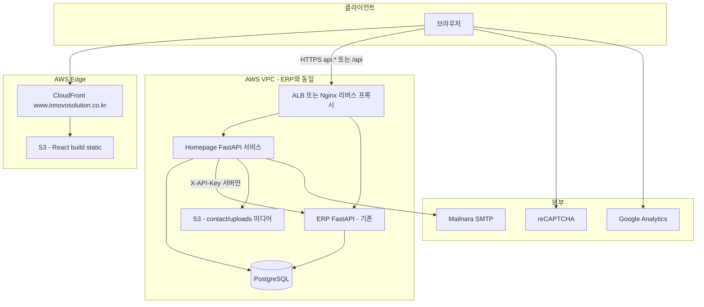

# 05. AWS ERP 통합 + React/CloudFront 배포 기획서

> **작성일**: 2026-05-31  
> **상태**: 초안 — **사용자·ERP 팀 확인 항목(§12) 답변 후 GO**  
> **역할**: Planner (코드 미수정, 기획만)  
> **연관 문서**: `00_master_plan.md`, `02_plan_erp_logic_migration.md`, `03_plan_quick_quote_integration.md`, `document/data_dictionary/00_schema.md`  
> **목적**: Innovo_homepage 백엔드·DB를 **이미 AWS에 운영 중인 ERP(socket_auto_design)** 와 통합하고, 프론트엔드를 **React SPA + CloudFront** 로 전환·배포하기 위한 실행 계획

---

## 1. 배경 및 목표

### 1-1. 배경

| 구분 | 현재 (코드 기준) | 목표 |
|------|------------------|------|
| 프론트 | Jinja2 템플릿 27개 + Vanilla JS + Tailwind (`frontend/templates/`, `frontend/js/`) | **React SPA** — S3 정적 호스팅 + **CloudFront** |
| 백엔드 | 독립 FastAPI `backend/main.py` v0.2.0 — 페이지 라우트 + API 라우터 | ERP AWS 환경에 **통합 배포** (동일 VPC·운영 체계) |
| DB | PostgreSQL DB명 `innovo_homepage` (Alembic revision 001~004) | ERP 인프라의 PostgreSQL **공유 또는 VPC 내부 전용 DB** |
| ERP 연동 | `.env`에 `ERP_API_BASE_URL`만 정의, Quick Quote → ERP 전송 **미구현** | `api/public`·`api/external` 연동 **운영 반영** |

> **참고**: `.env.example` 에 `POSTGRES_HOST=172.31.12.218`(ERP EC2 Private IP) 가 이미 명시되어 있어, DB는 **ERP와 동일 VPC 내 PostgreSQL** 을 전제로 한 설계가 자연스럽다.

### 1-2. 목표 (측정 가능)

1. **단일 운영면**: 홈페이지 API·DB·ERP가 동일 AWS 계정/VPC에서 관리·백업·모니터링 가능
2. **프론트 분리**: HTML 서버 렌더링 제거 → React가 `https://www.innovosolution.co.kr` (CloudFront) 제공
3. **기능 유지**: Phase 3까지 구현된 API·화면 동작을 React 전환 후에도 동일하게 제공
4. **확장 준비**: Phase 4 Quote Wizard는 ERP `POST /api/public/quote-estimate` 프록시 구조로 이어갈 수 있게 설계

### 1-3. 비목표 (본 기획 범위 밖)

- ERP 본체(socket_auto_design) 내부 비즈니스 로직 대규모 리팩터
- Phase 4 Quote Wizard UI·DB 마스터 이식 **전체 구현** (구조만 열어두고 별도 Phase 4 기획서에서 상세화)
- `live` 브랜치 운영 배포 실행 (사용자 배포 요청 시 별도 절차)

---

## 2. 현황 분석 (코드에서 확인한 사실)

### 2-1. 백엔드 API 인벤토리

| Prefix | 주요 엔드포인트 | 용도 |
|--------|-----------------|------|
| `/api` | `POST /quick-quote` | Quick Quote 접수 |
| `/api` | `POST /contact` | Contact 문의 (multipart 첨부) |
| `/api/auth` | `register`, `login`, `logout`, `refresh`, `verify-email`, `forgot-password`, `reset-password`, `me` | B2B 회원 |
| `/admin/api` | `login`, `verify-2fa`, `quick-quotes`, `contacts`, `users` | 내부 Admin |
| — | `GET /health` | 헬스체크 |

**페이지 라우트** (`main.py`): `/{lang}/` (en|ko), about, products, technology, contact, quote, privacy, terms, auth 5종, `/admin/*` 6종 — 전부 Jinja2 `TemplateResponse`.

### 2-2. PostgreSQL 스키마 (홈페이지 전용)

| 테이블 | Revision | 비고 |
|--------|----------|------|
| `quick_quote_inquiries` | 001 | `erp_inquiry_id` 컬럼 존재, Phase 5 연동용 |
| `users`, `email_verification_tokens`, `password_reset_tokens` | 002 | `membership_tier`: general / verified |
| `contact_inquiries` | 003 | 첨부 `upload/contact/` |
| `staff_accounts`, `staff_login_otp` | 004 | roles JSON, 2FA OTP |

**미구현 테이블**: `lead_time_rules`, ERP 마스터(`socket_type`, `service_cost_logic` 등) — Phase 4·ERP API 방식(`02_plan` §0)으로 처리 예정.

### 2-3. 설정 (`backend/config.py` + `.env.example`)

| 변수 | 코드 반영 | 기획 비고 |
|------|-----------|----------|
| `POSTGRES_*` | ✅ `database_url` | 예시 Host = ERP Private IP |
| `ERP_API_BASE_URL` | ✅ Settings 필드 | `ERP_API_KEY`는 **Settings 미정의** — Phase 5 전 `config.py` 추가 필요 |
| `APP_BASE_URL` | ✅ | 이메일 링크 — CloudFront 도메인으로 운영 값 변경 |
| SMTP, reCAPTCHA, JWT | ✅ | Mailnara·v3 유지 |

### 2-4. 프론트엔드 자산

| 유형 | 경로 | React 이전 시 |
|------|------|---------------|
| i18n JSON | `frontend/content/i18n/*.json`, `legal/*.json` | `react-i18next` 리소스로 import |
| 제품 카탈로그 JSON | `frontend/content/products/*.json` | 동일 JSON fetch 또는 빌드 시 번들 |
| CSS | `frontend/css/` (Tailwind) | React 프로젝트 Tailwind 설정 이전 |
| JS | `contact.js`, `auth.js`, `admin.js` 등 7파일 | React hooks + API client로 대체 |
| 미디어 | `upload/` (로고, 렌더링, 특허 등) | **S3 버킷** + CloudFront 또는 `/upload` API 프록시 |

### 2-5. ERP 연동 기획 (확정 스펙 — `02_plan` §0)

| 트랙 | 방향 | 홈페이지 역할 |
|------|------|---------------|
| 마스터·가견적 | `GET/POST {ERP_API_BASE_URL}/api/public/*` | FastAPI가 **서버 사이드 프록시** (API Key 노출 방지) |
| Quick Quote 접수 | `POST {ERP_API_BASE_URL}/api/external/inquiry` | 접수 후 `erp_inquiry_id` 저장 (`03_plan`) |
| CORS | `www.innovosolution.co.kr` ERP 허용 완료(기획서 기재) | React는 **동일 오리진 API** 권장 → CORS 이슈 최소화 |

---

## 3. 목표 아키텍처

### 3-1. 논리 구성도



### 3-2. DNS·도메인 (권장안)

| 호스트 | 역할 | 서비스 |
|--------|------|--------|
| `www.innovosolution.co.kr` | React SPA | CloudFront → S3 |
| `innovosolution.co.kr` | apex → `www` 리다이렉트 | CloudFront 또는 Route 53 |
| `api.innovosolution.co.kr` (권장) | Homepage + (선택) ERP public 프록시 | ALB → EC2 FastAPI |
| 기존 ERP URL | 내부·기존 클라이언트 | 변경 최소화 |

> **확인 필요(§12)**: API를 서브도메인으로 분리할지, `www` 동일 도메인 `/api` 경로로 CloudFront → ALB 오리진 패스스루할지.

### 3-3. DB 통합 전략 (3안 — **1안 권장**)

| 안 | 설명 | 장점 | 단점 |
|----|------|------|------|
| **1안 권장** | 동일 PostgreSQL **인스턴스**, DB `innovo_homepage` **유지** (현재 Alembic 그대로) | ERP·홈페이지 스키마 분리, 마이그레이션 독립, `.env.example`와 일치 | 인스턴스 용량·백업 정책 공유 |
| 2안 | ERP DB **단일 DB**에 `hp_` 접두 테이블 통합 | 연결 1개 | Alembic·권한·ERP 마이그레이션 충돌 위험 큼 |
| 3안 | RDS 별도 + VPC Peering | 완전 격리 | 운영·비용·지연 증가, 현재 Private IP 전제와 불일치 |

**1안 상세**

- PostgreSQL: ERP EC2 로컬 PG 또는 ERP가 쓰는 RDS — **동일 `POSTGRES_HOST`**
- DB명: `innovo_homepage` (변경 없음)
- DB 사용자: `homepage_user` — ERP DB에 대해 **최소 권한**(홈페이지 테이블만 DML)
- ERP 마스터 테이블: 홈페이지 DB에 **복제하지 않음** — `02_plan` API 방식 유지

### 3-4. 백엔드 배포 통합 (3안 — **A안 권장**)

| 안 | 설명 | 권장 시점 |
|----|------|----------|
| **A. 동일 EC2 별도 systemd 서비스** | ERP EC2에 `innovo-homepage-api` 추가, Nginx `/api` → :8001 | **1차 오픈** — VPC·DB 이미 연결된 상태와 부합 |
| B. ERP FastAPI 앱에 Router mount | `app.include_router(homepage_router)` | ERP 팀 합의·릴리즈 주기 동기화 필요 시 |
| C. ECS/Fargate | 컨테이너 분리 | 트래픽·팀 역량 성숙 후 |

**A안 운영 요건**

- Python venv 분리 (`/opt/innovo-homepage/venv`)
- `alembic upgrade head` 배포 훅
- `.env`는 EC2 `/opt/innovo-homepage/.env` (Git 미포함)
- Nginx: `client_max_body_size` Contact 업로드(10MB) 반영
- `GET /health` → ALB Target Group 헬스체크

### 3-5. React + CloudFront

| 항목 | 결정 |
|------|------|
| 빌드 도구 | **Vite + React 18+ + TypeScript** (권장) |
| 스타일 | **Tailwind CSS** — 기존 `frontend/css` 토큰·컬러(`#26337D`, `#1C93D2`) 이전 |
| 라우팅 | `react-router-dom` v6 — `/:lang/*` (`en` \| `ko`) |
| i18n | `react-i18next` — 기존 JSON 재사용 |
| 데이터 | `@tanstack/react-query` — API 캐시·로딩 상태 |
| Admin | **동일 React 앱** 내 `/admin` 라우트 (코드 스플릿) 또는 별도 빌드 — §12 확인 |
| 인증 | Access JWT `localStorage` 또는 `httpOnly` 쿠키 — §12 보안 정책 |

**CloudFront 필수 설정**

- Origin 1: S3 (OAC/OAI)
- **SPA fallback**: 403/404 → `/index.html` (200)
- `/_next` 없음 — Vite `assets/` cache long-term
- **HTTPS**: ACM 인증서 `*.innovosolution.co.kr` (us-east-1 for CloudFront)
- **헤더**: `Cache-Control` — `index.html` no-cache, hashed assets max-age 1y
- **보안 헤더** (Response Headers Policy): CSP, HSTS, X-Frame-Options

---

## 4. API·프론트 계약 (React 전환 후)

### 4-1. FastAPI 변경 요약

| 현재 | 변경 후 |
|------|---------|
| `TemplateResponse` 페이지 라우트 ~20개 | **제거** 또는 개발용만 유지 |
| `/static/css`, `/static/js` mount | 제거 (React 빌드가 담당) |
| `/upload` StaticFiles | **운영**: S3 URL 또는 `GET /media/*` 프록시 |
| CORS | `https://www.innovosolution.co.kr` allow |

**유지·확장 API** (기존 경로 유지 권장 — React 클라이언트 호환)

```
GET  /health
POST /api/quick-quote
POST /api/contact
POST /api/auth/*
GET  /api/auth/me
POST /admin/api/*
```

**추가 권장 (BFF 프록시)**

```
GET  /api/erp/socket-types          → ERP GET /api/public/socket-types
GET  /api/erp/ic-package-types
POST /api/erp/quote-estimate        → ERP POST /api/public/quote-estimate (Phase 4)
POST /api/erp/external-inquiry      → ERP POST /api/external/inquiry (Phase 5)
```

- `ERP_API_KEY`는 **백엔드만** 보유 — React에 절대 노출 금지
- `backend/config.py`에 `erp_api_key: str = ""` 추가 (`.env.example` 동기화)

### 4-2. React 페이지 ↔ API 매핑

| React Route | 기존 템플릿 | API / 데이터 |
|-------------|-------------|--------------|
| `/:lang/` | `pages/home.html` | i18n `home.{lang}.json` |
| `/:lang/about` | `about.html` | `about.*.json` |
| `/:lang/products` | `products/index.html` | `products.*.json` + catalog JSON |
| `/:lang/products/:slug` | `category.html` 등 | catalog JSON |
| `/:lang/technology` | `technology.html` | i18n |
| `/:lang/contact` | `contact.html` | `POST /api/contact` |
| `/:lang/quote` | `quick_quote_form.html` | `POST /api/quick-quote` |
| `/:lang/login` 등 | `auth/*.html` | `/api/auth/*` |
| `/:lang/privacy`, `terms` | `legal/document.html` | `legal/*.json` |
| `/admin/*` | `admin/*.html` | `/admin/api/*` |

**루트 `/`**: `Accept-Language` 또는 저장 locale → `/en/` 또는 `/ko/` redirect (기존 `main.py` 동작 유지).

---

## 5. ERP 통합 작업 상세

### 5-1. Phase 5 — Quick Quote → ERP (코드 갭)

**현재**: `quick_quote.py`는 DB 저장 + Mailnara만 수행, `erp_inquiry_id` 미설정.

**목표 흐름** (`03_plan` §4-2):

```
POST /api/quick-quote
  → innovo_homepage DB insert
  → (비동기 또는 동기) POST {ERP_API_BASE_URL}/api/external/inquiry
  → 성공 시 status=sent_to_erp, erp_inquiry_id 저장
  → 실패 시 status=pending 유지 + 재시도 큐(선택)
```

**구현 체크리스트**

- [ ] `Settings.erp_api_key` 추가
- [ ] `backend/utils/erp_client.py` — httpx, timeout, X-API-Key
- [ ] payload 매핑: `QuickQuoteInquiry` → ERP inquiry body (`ic_package_type_code` 등)
- [ ] Admin PATCH 시 ERP 상태 동기화 여부 — §12

### 5-2. Phase 4 — Quote Wizard (React + ERP API)

- 홈페이지 DB에 ERP 마스터 **pg_dump 불필요** (`02_plan` 2026-05-27 변경)
- React 1단계: `GET /api/erp/socket-types` 로 패밀리 추천 UI
- React 3단계: `POST /api/erp/quote-estimate` + 회원 등급은 **홈페이지 백엔드**에서 tier 반영 후 ERP 호출 또는 ERP 응답 후 tier 가공 (일반회원 ×1.3 — 마스터 §7-1)
- 견적 히스토리·PDF: 홈페이지 전용 테이블 **신규** Alembic (Phase 4 별도 기획서)

### 5-3. 네트워크·보안

| 항목 | 요구사항 |
|------|----------|
| VPC | Homepage API ↔ PostgreSQL ↔ ERP API **Private 통신** |
| Security Group | ALB 443 인바운드; EC2 8001은 ALB만 |
| API Key 로테이션 | ERP 팀과 분기별 또는 유출 시 |
| Rate limit | 기존 `rate_limit.py` 유지 |
| 파일 업로드 | S3 presigned URL 전환 검토 (EC2 디스크 의존 제거) |

---

## 6. React 마이그레이션 단계

### 6-1. 프로젝트 구조 (신규)

```
Innovo_homepage/
├── frontend-react/          # 신규 — Vite React 앱
│   ├── src/
│   │   ├── pages/
│   │   ├── components/
│   │   ├── api/             # axios/fetch wrappers
│   │   ├── i18n/
│   │   └── routes/
│   ├── public/
│   └── vite.config.ts
├── backend/                 # API 전용화 (Jinja 제거)
└── frontend/                # 전환 완료 전까지 유지 · 이후 archive
```

> **규칙 충돌 해소**: `CLAUDE.md` Vanilla-only는 **신규 기능 개발 방향**이었으나, 본 프로젝트는 사용자 승인 하에 **React 스택으로 전환**하는 예외 마이그레이션으로 명시한다.

### 6-2. 마이그레이션 순서 (화면별)

| 순서 | 화면 | 이유 |
|------|------|------|
| 1 | `base` 레이아웃, Header/Footer, i18n, 라우팅 | 전 페이지 공통 |
| 2 | Home, About, Technology | API 의존 낮음 — CloudFront 배포 검증 |
| 3 | Products (+ probe-pin 하위 3페이지) | JSON·이미지 경로 검증 |
| 4 | Contact, Quote | API·reCAPTCHA |
| 5 | Auth 5페이지 | JWT·이메일 링크 `APP_BASE_URL` |
| 6 | Legal, Cookie banner, GA | GDPR |
| 7 | Admin | 2FA·JWT·파일 다운로드 |

### 6-3. 디자인·a11y 이관

- 마스터 §6 컬러·폰트(Barlow, Inter, Noto Sans KR) — `tailwind.config` theme extend
- `upload/` 이미지 URL: 빌드 시 `VITE_MEDIA_BASE_URL=https://cdn.../upload` 
- 기존 `partials/cookie_banner.html` → React 컴포넌트 + 동일 consent 로직

---

## 7. CI/CD 및 배포 파이프라인

### 7-1. Git 브랜치 (기존 규칙 유지)

- 개발: `master`
- 운영: `live` — **사용자 배포 요청 시에만** merge

### 7-2. 파이프라인 (권장)

| 단계 | 트리거 | 동작 |
|------|--------|------|
| CI | PR / push master | `frontend-react`: lint, test, `npm run build` |
| | | `backend`: pytest, ruff |
| CD-Frontend | merge → `live` | `aws s3 sync dist/ s3://innovo-www-prod/` + CloudFront invalidation `/*` |
| CD-API | merge → `live` | SSH 또는 SSM → `git pull` → `alembic upgrade` → `systemctl restart innovo-homepage-api` |

> GitHub Actions OIDC → AWS IAM Role 권장 (장기 Access Key 지양).

### 7-3. 환경 분리

| 환경 | CloudFront | API | DB |
|------|------------|-----|-----|
| dev | (선택) CloudFront preview 또는 localhost:5173 | localhost:8000 | local PostgreSQL |
| staging | `staging.www...` 또는 별도 distribution | staging API EC2 | `innovo_homepage_stg` |
| prod | `www.innovosolution.co.kr` | `api.innovosolution.co.kr` | `innovo_homepage` |

---

## 8. 데이터·파일 마이그레이션

| 데이터 | 작업 |
|--------|------|
| PostgreSQL | ERP 서버에 DB 생성 → `alembic upgrade head` → (기존 로컬 데이터 있으면 `pg_dump` 이전) |
| `upload/` | S3 버킷 `innovo-media-prod` 업로드, 경로 prefix 유지 (`logo/`, `products/`…) |
| Contact 첨부 | 신규부터 S3; 기존 `upload/contact/` 파일 일괄 sync |
| `.env` | 운영 secrets — SSM Parameter Store 또는 EC2 파일 |

---

## 9. 테스트·검증 계획

### 9-1. 통합 테스트

| # | 시나리오 | 기대 결과 |
|---|----------|----------|
| T1 | CloudFront `/{lang}/products` 새로고침 | 200, SPA 정상 (fallback) |
| T2 | `POST /api/quick-quote` → ERP | `erp_inquiry_id` 저장, ERP 대시보드 노출 |
| T3 | Contact 10MB 첨부 | S3/디스크 저장, Admin 다운로드 |
| T4 | 회원 가입 → 메일 링크 | `APP_BASE_URL`이 www 도메인 |
| T5 | Admin 2FA 로그인 | JWT + OTP |
| T6 | ERP API 장애 시 Quick Quote | DB·고객 메일은 성공, ERP만 재시도 |

### 9-2. 성능·보안

- CloudFront + S3: Lighthouse LCP 개선 목표 (정적 자산 edge cache)
- `npm audit`, OWASP ZAP (staging) — Admin·Auth 엔드포인트
- CSP: inline script 최소화 (reCAPTCHA·GA 예외 도메인 명시)

---

## 10. 일정·마일스톤 (견적)

> 인력 1명 풀타임 기준 **대략** — §12 확인 후 조정.

| Milestone | 기간 | 산출물 |
|-----------|------|--------|
| M0 기획 확정 | 1주 | §12 답변, ERP·인프라 접근 권한 |
| M1 인프라 | 1~2주 | VPC/SG, S3, CloudFront, ACM, API Nginx, DB 생성 |
| M2 API 정리 | 1주 | Jinja 제거, CORS, `erp_client`, health on ALB |
| M3 React 골격 + 공개 6페이지 | 2~3주 | staging CloudFront |
| M4 Contact·Quote·Auth | 2주 | E2E 메일·reCAPTCHA |
| M5 Admin + ERP Quick Quote 연동 | 1~2주 | 운영 dry-run |
| M6 DNS cutover | 1일 | www → CloudFront, 모니터링 |
| M7 (선택) Phase 4 Wizard | 별도 | `02_plan` 연계 |

---

## 11. 리스크 및 완화

| 리스크 | 영향 | 완화 |
|--------|------|------|
| ERP API 스펙 변경 | 가견적·접수 실패 | 버전 협의, contract test, feature flag |
| React 전환 범위 과대 | 일정 지연 | 화면 우선순위 §6-2 고수, Admin 마지막 |
| CloudFront 캐시로 구버전 노출 | 사용자 혼란 | index.html no-cache, 배포 invalidation 자동화 |
| API Key 프론트 노출 | 보안 사고 | BFF 프록시만, 코드 scan |
| DB ERP와 리소스 경합 | 성능 | connection pool limit, 모니터링 |
| `.env.example`에 실제 비밀번호 패턴 | 유출 위험 | 운영 전 example 정리, rotate |

---

## 12. 확인 필요 사항 (담당자 답변 후 기획 v1.1 갱신)

아래는 **코드로 알 수 없는** 비즈니스·인프라 결정이다. 답변 전에는 §3의 “권장안”으로만 진행한다.

| # | 질문 | 선택지 | 담당 |
|---|------|--------|------|
| Q1 | ERP AWS 구성 | EC2 단독 PG / RDS / 다중 EC2? 현재 `172.31.12.218` 역할? | ERP·인프라 |
| Q2 | Homepage API 공개 방식 | `api.innovosolution.co.kr` vs `www.../api` path | IT |
| Q3 | 백엔드 통합 안 | A(systemd 별도) / B(ERP mount) / C(ECS) | ERP·개발 |
| Q4 | Admin UI | React 통합 vs 기존 Vanilla Admin 임시 유지 | 영업·개발 |
| Q5 | `upload/` 운영 | S3+CloudFront OAC vs EC2 Nginx static | 인프라 |
| Q6 | ERP `ERP_API_KEY` 발급·로테이션 | 키 값·만료 정책 | ERP |
| Q7 | Quick Quote ERP 실패 시 | 고객에게 성공 표시 + 백그라운드 재시도 vs 즉시 오류 | 영업 |
| Q8 | React 프레임워크 승인 | Vite+TS vs CRA vs Next.js(SSR 불필요) | 개발 |
| Q9 | JWT 저장 | localStorage vs httpOnly Secure cookie | 보안 |
| Q10 | Phase 4 Wizard | 본 배포 **필수 포함** vs **2차 릴리스** | 대표 |
| Q11 | 기존 `frontend/` 처리 | archive vs 삭제 시점 | 개발 |
| Q12 | staging 환경 필요 여부 | yes/no | IT |

---

## 13. 자체 검토 (기획서 품질)

| 기준 | 평가 | 비고 |
|------|------|------|
| 코드 기반 현황 | ✅ | API·테이블·템플릿 수·config 실측 반영 |
| 목표 아키텍처 | ✅ | DB 1안·배포 A안·CloudFront SPA 명시 |
| 개발 착수 가능? | **조건부 GO** | §12 Q1~Q3·Q6 없으면 M1 인프라 착수 불가 |
| Phase 4 포함 여부 | ⚠️ | 골격만 — 상세는 별도 `01_plan_phase4_quote_wizard.md` 필요 |
| ERP API Key in Settings | ⚠️ | 구현 갭 명시됨 |

---

## 14. 승인·다음 단계

1. **사용자 검토**: 본 문서 + §12 답변
2. **승인 키워드**: "진행해" / "좋아" → M0~M1 인프라·`frontend-react` 스캐폴딩 착수
3. **문서 갱신**: 답변 반영 → v1.1, `00_plan_gap_checklist.md` Phase 6 항목 추가
4. **ERP 팀 공유**: `03_plan` external inquiry + `02_plan` public API 동시 일정 합의

---

## 부록 A. 환경변수 체크리스트 (운영)

```bash
# PostgreSQL (ERP VPC)
POSTGRES_HOST=
POSTGRES_PORT=5432
POSTGRES_DB=innovo_homepage
POSTGRES_USER=
POSTGRES_PASSWORD=

# App
APP_ENV=production
APP_BASE_URL=https://www.innovosolution.co.kr
SECRET_KEY=
ADMIN_SECRET_KEY=

# ERP
ERP_API_BASE_URL=https://<erp-host>
ERP_API_KEY=

# SMTP, reCAPTCHA, JWT — 기존과 동일 (.env.example 참고)

# React build (CI)
VITE_API_BASE_URL=https://api.innovosolution.co.kr
VITE_RECAPTCHA_SITE_KEY=
VITE_MEDIA_BASE_URL=https://<cdn>/upload
```

## 부록 B. 관련 파일 경로 (구현 시)

| 영역 | 경로 |
|------|------|
| FastAPI 진입 | `backend/main.py` |
| 설정 | `backend/config.py` |
| ORM | `backend/models.py` |
| Alembic | `database/versions/` |
| 기존 템플릿 | `frontend/templates/` |
| i18n | `frontend/content/` |
